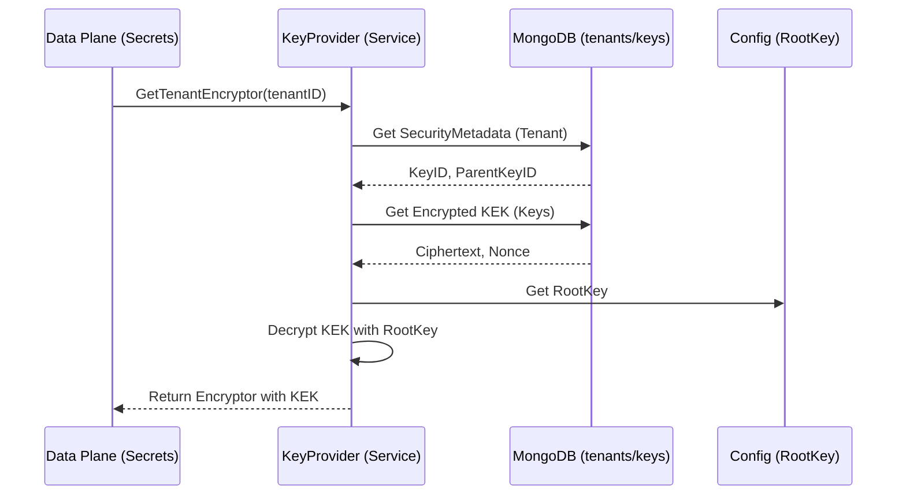

# Arquitetura de Criptografia: Root Key & Tenant KEK

Este documento descreve como o Lockari protege as chaves de criptografia de cada tenant utilizando uma### 1. DNS Provisioning (Item 6)
Todo tenant recém-criado recebe automaticamente um **Fully Qualified Domain Name (FQDN)** baseado no seu `slug` e no domínio base configurado (ex: `lockari.com`).

- **Regra**: `tenant.slug` + `.` + `app.base_domain`
- **Exemplo**: `mytenant.lockari.com`
- **Armazenamento**: Propriedade `fully_qualified_domain` no objeto Tenant.

### 2. Hierarquia de Chaves (L1 -> L2)

## Hierarquia de Chaves

O sistema utiliza três níveis de chaves para garantir segurança e isolamento:

| Nível | Nome | Descrição | Armazenamento |
| :--- | :--- | :--- | :--- |
| **L1** | **Root Key** | Chave mestre global usada para cifrar as KEKs dos tenants. | `config.yaml` (Vault) |
| **L2** | **KEK (Key Encryption Key)** | Chave única por tenant usada para cifrar as DEKs dos segredos. | MongoDB (Collection `keys`), cifrada pela Root Key. |
| **L3** | **DEK (Data Encryption Key)** | Chave de uso único para cifrar o dado real (Segredo). | MongoDB (junto ao segredo), cifrada pela KEK do tenant. |

---

## Fluxo de Provisionamento (Escrita)

1.  **Geração**: O `WorkerTenant` gera uma KEK randômica de 32 bytes para o novo tenant.
2.  **Proteção (Root Key)**: A KEK é cifrada usando a `RootKey` (L1).
3.  **Persistência**: 
    - O conteúdo cifrado (envelope) é salvo na collection `keys`.
    - O ID da chave (`KeyID`) e o ID da Root Key (`ParentKeyID`) são salvos nos metadados do `tenant`.

## Fluxo do Key Provider (Leitura)

O `KeyProvider` é o serviço responsável por "hidratar" a chave para que o Data Plane possa usá-la.

1.  **Resgate**: Busca os metadados no `tenant` para encontrar o `KeyID`.
2.  **Recuperação**: Busca o material cifrado na collection `keys`.
3.  **Decriptação**: Usa a `RootKey` do sistema para decifrar a KEK.
4.  **Instanciação**: Retorna um objeto `Encryptor` pronto para cifrar/decifrar dados reais do tenant.

---

## Feedback de Provisionamento (UI)

Como o provisionamento é assíncrono, a interface deve seguir o seguinte fluxo:

1.  **Criação**: O `POST /api/v1/tenants` retorna `202 Accepted` com o status `pending`.
2.  **Polling**: A UI deve realizar chamadas periódicas para `GET /api/v1/tenants/id/:id` ou `GET /api/v1/tenants/slug/:slug`.
3.  **Estados de Feedback**:
    - `pending`: Provisionamento em curso. Exibir "spinner" ou "aguarde".
    - `active`: Provisionamento concluído com sucesso. Tenant pronto para uso.
    - `failed`: Ocorreu um erro no provisionamento. Exibir mensagem de erro ou botão de "tentar novamente".

## Diagrama de Sequência (Key Provider)



---

## Notificações e Onboarding (Item 4)

O sistema notifica usuários e sistemas externos via:
- **Email de Boas-vindas**: Disparado assim que o tenant atinge o status `ACTIVE`.
- **Webhooks**: Notificação via POST para sistemas externos interessados no evento de ativação.

#### Payload do Webhook (`TENANT_ACTIVATED`)
```json
{
  "event": "TENANT_ACTIVATED",
  "timestamp": "2024-02-09T12:00:00Z",
  "data": {
    "id": "uuid-do-tenant",
    "name": "Nome do Tenant",
    "slug": "slug-do-tenant",
    "status": "ACTIVE"
  }
}
```
As falhas no envio de notificações são logadas mas não interrompem o fluxo de provisionamento, garantindo que o tenant permaneça funcional.

---

## Estratégia de Cleanup e Recuperação (Item 5)

O Lockari utiliza uma estratégia de "Compensating Transactions" e "Idempotency" para garantir a consistência do sistema durante falhas no provisionamento assíncrono.

### 1. Cleanup de Recursos Órfãos
Se o provisionamento falhar imediatamente após a criação de uma chave (L2) mas antes dela ser vinculada ao tenant, o sistema realiza o **rollback imediato**, deletando a chave do banco de dados para evitar "chaves órfãs".

### 2. Status FAILED e Mensagem de Erro
Quando uma falha crítica ocorre (ex: erro de rede no banco de dados), o tenant é marcado com status `FAILED` e o campo `failure_reason` é preenchido com a mensagem de erro técnica capturada pelo Worker.

### 3. Idempotência e Retentativa (Resume)
O Worker de provisionamento é idempotente. Se ele receber um evento para um tenant que já possui uma `KeyID` vinculada mas está em status `FAILED`, ele tentará **retomar** o provisionamento a partir do ponto de falha atual, em vez de gerar novos recursos.

---

---

## Quotas e Limites (Resource Limits)

Cada tenant é provisionado com limites padrão para evitar abusos de recursos.

### Limites Padrão (Default)
| Propriedade | Chave Interna | Descrição | Valor Sugerido |
| :--- | :--- | :--- | :--- |
| **Max Secrets** | `quota_max_secrets` | Total de segredos permitidos por tenant. | 100 |
| **Max Users** | `quota_max_users` | Total de usuários vinculados ao tenant. | 10 |
| **Max Storage** | `quota_max_storage_bytes` | Espaço total em disco (em bytes). | 1GB |

Estes valores podem ser ajustados individualmente para cada tenant via Painel de Controle (Update Properties).

---

## Rotação de Root Keys (Lifecycle)

O Lockari suporta a rotação da Root Key (L1) sem interrupção de serviço através do identificador `ParentKeyID`.

### Como funciona:
1.  **Novos Tenants**: Sempre utilizam a chave definida em `root_key_id` no `config.yaml`.
2.  **Tenants Existentes**: Mantêm o `ParentKeyID` da chave com a qual foram provisionados.
3.  **Resolução de Chave**: No momento da decriptação, o `KeyProvider` busca no mapa `root_keys` do `config.yaml` o material da chave correspondente ao `ParentKeyID` do tenant.

### Exemplo de Configuração de Rotação (`config.yaml`):
```yaml
vault:
  root_key_id: "root-2025-v2" # Nova chave ativa
  root_keys:
    "root-2024-v1": "material-antigo-base64..."
    "root-2025-v2": "material-novo-base64..."
```

> [!IMPORTANT]
> Nunca remova uma chave de `root_keys` se ainda houver tenants que a utilizam como `ParentKeyID`, caso contrário, os dados desses tenants se tornarão inacessíveis.
